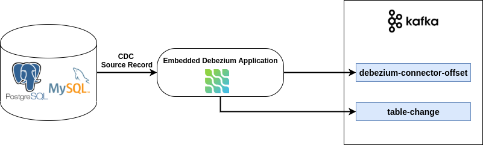

# Embedded Debezium

一个利用embedded Debezium捕捉(PostgreSQL / MySQL)实时变化数据的demo

## 相关技术栈
- Embedded Debezium
- Spring Boot
- Kafka
- MySQL / PostgreSQL


## 架构


## 应用
`EmbeddedDebeziumApplication` 
- 利用 embedded Debezium 获取变化的数据
- 生成包含更改的数据库名称、模式名称和表的名称到 topic `table-change`
- 提供偏移量，定义了消费的位置（`debezium-connector-offset`）,程序重启后会在上次的消费位置继续消费
- 对于mysql来说，会提供数据库历史历史到topic `dbz-history`
- 消费topic `table-change`,并打印（后续可以根据需要灵活处理）


## 启动
选择你要运行的数据库，docker脚本已写好
- PostgreSQL
```shell script
./run.sh postgres
```
or
- MySQL
```shell script
./run.sh mysql
```
在终端运行即可.


## 停止
在终端中根据你选择的数据库，执行一下脚本命令，当然你也可以 docker中手动关闭

- PostgreSQL
```shell script
./stop.sh postgres
```
- MySQL
```shell script
./stop.sh mysql
```